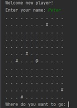
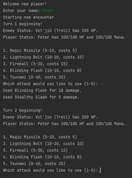

# RPG Text Game

Written and developed by Peter Mitchell (2021).

The content in this Github is a teaching tool that walks through step by step to write a simple text based RPG Text Game in Java. The PDF in this directory RPGTextGame.pdf defines a walkthrough split into 9 individual parts followed by possible exensions to further improve the game beyond the initial definition. The flow of the game is simple, but it teaches and practices many important elements.

The other directories included have solution content based on what is described in the PDF. These are listed below.
* RPGTextGame: This contains a version of the game with full Javadoc comments explaining what everything does.
* RPGTextGame_AllParts: Contains a single IntelliJ Project with packages containing each different numbered step.
* RPGTextGame_IndividualParts: Contains just the java files for each individual step as separate folders.

# Controls

The player controls the game via the console and begins by entering their name. After entering the name the game swaps between two different states. Firstly where the player is traversing the map. You are represented as an \@ symbol and the \# symboles represent enemies. You move around the map by typing in up/down/left/right. When you reach a \#, the game enters combat against a random encounter with an enemy. You can use the abilities by entering the number corresponding to the ability. Each ability has an associated mana cost. When you defeat the enemies you will heal back up and continue in the map phase. However, if you lose during an encounter the entire game is lost. Defeating all the encounters results in winning the entire game.

You can see an example of gameplay at: <https://youtu.be/7o3ZetXnE3g>

 